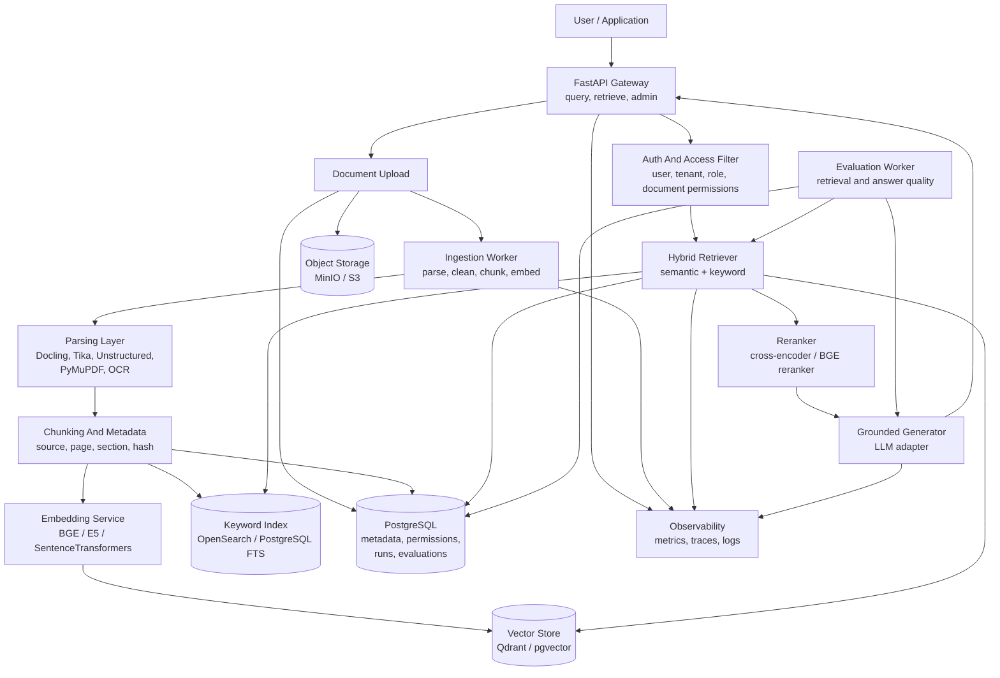

# RAG Platform Architecture

## Flow Summary

1. Documents are uploaded or batch imported.
2. Ingestion workers parse files, extract metadata, chunk content, and create embeddings.
3. Chunks are stored with source lineage and permissions.
4. User query is filtered by access rights.
5. Retriever combines semantic and keyword search.
6. Reranker improves final context order.
7. Generator answers only from retrieved evidence and returns citations.
8. Evaluation jobs measure retrieval and answer quality over time.

