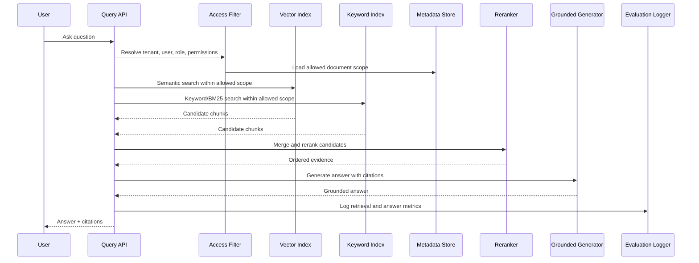

# Low-Level Design

## Key Controls

| Control | Purpose |
| --- | --- |
| ACL filtering | Prevent retrieval from unauthorized documents. |
| Hybrid retrieval | Improve recall for semantic and exact-match queries. |
| Reranking | Reduce noisy context before generation. |
| Citations | Make answers traceable to source chunks. |
| Evaluation logging | Track quality, latency, and drift. |
